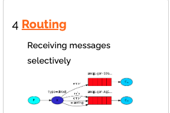

# SpringCloud Learn

## 分布式架构需要考虑的问题
1. 服务拆分粒度如何
2. 服务集群地址如何维护
3. 服务之间如何实现远程调用
4. 服务健康状态如何感知

## 微服务
### 设么是微服务
- 一种良好的分布式架构方案

### 微服务特点
#### 基本特点
- **单一职责**
- **面向服务**：微服务对外暴露接口
- **自治**：团队独立、技术独立、数据独立(使用不同的数据库)、部署独立
- **隔离性**：服务做好隔离、容错、降级、避免级联问题

#### 优缺点
<p style="color: red; font-weight: bold">优点：拆分粒度更小、服务更独立、耦合度更低</p>
<p style="color: greenyellow; font-weight: bold">缺点：架构非常复杂；运维、监控、部署难度高</p>

## 单体架构与分布式架构的区别
### 单体架构特点
- 简单方便、高度耦合、扩展性差、是和小型项目。例：学生管理系统

### 分布式架构特点
- 解耦合、扩展性好、结构复杂难度大、适合大型互联网项目。例：京东、淘宝

## 服务拆分及远程调用
### 服务拆分注意事项
1. 不同微服务，不要重复开发相同业务
2. 微服务数据独立，不要访问其他微服务的数据库
3. 微服务可以将自己的业务暴露为接口，供其他微服务调用

## 服务的调用关系
- 服务提供者：暴露接口给其他微服务调用
- 服务消费者：调用其他微服务提供的接口
- 提供者与消费者角色是相对的

## Eureka注册中心
- EurekaServer：服务端，注册中心
  - 记录服务信息
  - 心跳监控
- EurekaClient：客户端
  - Provider：服务提供者
    - 注册自己的信息到 EurekaServer
    - 每隔 30s 向 Eureka 发送心跳
  - Consumer：服务消费者
    - 根据服务名称从 EurekaServer 拉去服务列表
    - 基于服务列表做负载均衡，选中后发起远程调用

### 搭建 EurekaServer
- 引入依赖
- 启动类添加 `@EnableEurekaServer` 注解
- 配置 `application.yml`

### 搭建 EurekaClient
- 引入依赖
- 配置 `application.yml`

### 服务的发现
- 引入 eureka-client 依赖
- 配置 eureka 地址
- RestTemplate 添加 @LoadBalance 注解
- 将 ip 替换为服务名称

## Ribbon 负载均衡
### 流程
1. service 发起请求
2. Ribbon 拦截
3. 调用注册中心
4. 进行负载均衡
5. 调用其他 service

### 饥饿加载
- Ribbon 默认采用懒加载
- 饥饿加载在项目启动时进行加载
- 配置
```yaml
ribbon:
  eager-load:
    enabled: true # 开启饥饿加载
    clients: user-service # 指定服务对该服务进行饥饿加载
```
```yaml
# 配置多个
ribbon:
  eager-load:
    enabled: true # 开启饥饿加载
    clients:
      - user-service
      - xxx-service
```

### 总结
1. Ribbon 负载均衡规则
   - 规则接口是 IRule
   - 默认实现是 ZoneAvoidanceRule，根据 zone 选择服务列表，然后轮询
2. 负载均衡自定义方式
   - 代码方式
   - 配置方式
3. 饥饿加载
   - 开启饥饿加载
   - 指定饥饿加载的微服务名称

## Nacos
### Nacos 服务搭建
   - 下载
   - 解压
   - 执行命令
   ```shell
    sh ./startup.sh -m standalone # 单机启动
   # Windows
   startup.cmd -m standalone
   ```
### Nacos 服务注册或发现
   - 引入 nacos.discovery 依赖
   - 配置 nacos 地址 spring.cloud.nacos.server-addr
### Nacos 服务分集存储模型
    - 服务-》集群-》实例
### 设置实例集群属性
   - 修改 application.yml 文件，添加 spring.cloud.nacos.discovery.cluster-name 属性
### NacosRule 负载均衡策略
   - 优先选择统计群服务实例列表
   - 本地集群找不到提供者，才去其他集群寻找，并且会告警
   - 确定可用实例列表后再采用随机负载均衡挑选实例
### 权重配置
   - 权重越大访问评率越高
   - Nacos 控制台配置
   - 为 0 时完全不会访问
### 环境隔离
   - namespace-》group-》service/data
   - 创建 namespace，nacos 控制台中配置
   - 不同 namespace 下的服务是不可见的
### Nacos 配置管理
1. 统一配置管理
    - nacos 控制台中配置
    - data id：[服务名称]-[profile].[后缀]
    - 内容为需要热更新的配置
2. 配置热更新
    - bootstrap.yml 优先级 > application.yml
    - 方式一：在 @Value 所在的类添加 @RefreshScope
    - 方式二：使用 @ConfigurationProperties `推荐`
3. 配置共享
    - 微服务启动时会从 nacos 读取多个配置文件
      - [spring.application.name]-[spring.profile.active].yaml `user-nacos-service-dev.yaml` **会变**
      - [spring.application.name].yaml `user-nacos-service.yaml` **不会变(放共享配置)**
      - 优先级: **服务名-profile.yaml > 服务名.yaml > 本地配置**
4. 搭建 Nacos 集群
   - 搭建 MySQL 集群并初始化数据库表
   - 下载 nacos
   - 修改集群配置
   - 分别启动多个 nacos 结点
   - Nginx 反向代理

## http 客户端 Feign
### 什么是 Feign
- Feign 是一个声明式的 http 客户端

### RestTemplate 方式调用存在的问题
- 代码可读性差，编程体验不统一
- 参数复杂 URL 难以维护

### Feign 的使用步骤
1. 引入依赖
2. 添加 @EnableFeignClient 注解
3. 编写 FeignClient 接口
4. 使用 FeignClient 中的方法替换 RestTemplate

### 自定义 Feign 配置

| 类型                  | 作用       | 说明                      |
|---------------------|----------|-------------------------|
| feign.logger.level  | 修改日志级别   | NONE、BASIC、HEADERS、FULL |
| feign.codec.Decoder | 响应结果的解析器 | 对调用的结果解析                |
| feign.codec.Encoder | 请求参数编码   |                         |
| feign.Contract      | 支持的注解格式  | 默认为 SpringMVC 注解        |
| feign.Retryer       | 失败重试机制   | 默认没有，不过会使用 Ribbon 的重试   |

- 配置文件方式
```yaml
feign:
  client:
    config:
#      default: # 全局生效
      user-feign-service: # 指定服务
        loggerLevel: FULL
```
- 代码方式
```java
public class FeignClientConfig() {
    @Bean
    public Logger.Level feignLogLevel() {
        return Logger.Level.BASIC;
    }
}
// 全局配置
@EnableFeignClient(defaultConfiguration = FeignClientConfig.class)

// 局部配置
@FeignClient(value="user-feign-service", configuration = FeignClientConfig.class)
```
### Feign 的性能优化
- 日志级别尽量用 BASIC
- 使用 HttpClient 或 OKHttp 代替 URLConnection

### Feign 的最佳实践
- 继承：给消费者的 FeignClient 和提供者的 Controller 定义统一的父接口作为标准 <p style="color:red;">紧耦合</p>
- 抽取：将 FeignClient 抽取为独立的模块，并且把有关接口的 pojo、默认的 Feign 配置都放到这个模块中，提供给所有的消费者使用
- FeignClient 不在 SpringBootApplication 的扫描包范围时，这些 FeignClient 无法使用。解决方案
  - 指定 FeignClient 所在的包`@EnableFeignClient(basePackages = "com.rui.feign.clients)`
  - 指定 FeignClient 字节码 `@EnableFeignClient(clients = {UserClient.class})`

## 统一网关 Gateway
### 为什么需要网关
- 网关的功能
  - 身份认证和权限校验
  - 服务路由、负载均衡
  - 请求限流

### SpringCloud 网关实现的两种方式
- gateway
- zuul
- Zuul 是基于 Servlet 的实现，属于阻塞式编程。SpringCloudGateway 基于 Spring5 中提供的 WebFlux，属于响应式编程的实现，具备更好的性能

### 路由的配置
- 网关路由可以配置的内容
  - 路由ID：路由的唯一标识
  - uri：路由的目的地址，支持 lb，http
  - predicates：路由断言
  - filters：路由过滤器

### 路由断言工厂

- 所有规则都无法匹配时 404

### 路由过滤器
- GatewayFilter 是网关中提供的一种过滤器，可以对进入网关的请求和微服务返回的响应做处理，逻辑固定

- Spring 提供了31种不同的路由过滤器工厂
- GlobalFilter 全局过滤器，可自定义过滤器

  
### 过滤器执行顺序
- 请求进入网关或碰到三类过滤器
  - 当前路由的过滤器
  - DefaultFilter
  - GlobalFilter
- 请求路由后，会将当前路由过滤器和 DefaultFilter、GlobalFilter 合并到一个过滤器链（集合）中，排序后一次执行每个过滤器
- 每一个过滤器都必须指定一个 int 类型的 order 值，order 值越小优先级越高执行顺序越靠前
- GlobalFilter 通过实现 Ordered 接口或添加 @Order 注解来指定 order 值
- 路由过滤器和 DefaultFilter 的 order 由 Spring 指定，默认是按照声明顺序从 1 递增
- <p style="color: red; font-weight: bold">当过滤器的 order 值一样时，会按照 DefaultFilter > 路由过滤器 > GlobalFilter 的顺序执行</p>


### 网关 CORS 跨域配置
- 跨域问题主要包括
  - 域名不同
  - 域名相同，端口不同
- 跨域问题：浏览器禁止请求的发起者与服务端发生跨域 ajax 请求，请求被浏览器拦截
- 解决方案： CORS


## 初识 MQ
### 同步通讯
- 优点
  - 时效性强，可以立即得到结果
- 缺点
  - 耦合度高：每次加入新的需求都要修改原来的代码
  - 性能和吞吐能力下降
  - 有额外的资源消耗
  - 有级联失败问题
### 异步通讯
- 优点
  - 解耦
  - 新能提升，吞吐量高
  - 服务没有强依赖，不用担心级联失败问题
  - 没有额外的资源浪费
  - 流量削峰
- 缺点
  - 依赖于`Broker(事件代理)`的可靠性、安全性、吞吐能力
  - 结构复杂了，业务没有明显的流程线，不好追踪管理
### 常见的 MQ
- MQ (Message Queue) 消息队列


### RabbitMQ
- 结构

- 概念
  - channel：造作 MQ 的工具
  - exchange：路由消息到队列中
  - queue：缓存消息
  - virtual host：虚拟主机，对 queue，exchange 等资源的逻辑划分
- 常见消息模型
  - 基本消息队列
  
  - 工作消息队列
  
  - 发布订阅
    - Fanout Exchange：广播
    
    - Direct Exchange：路由
    
    - Topic Exchange：主题
    
      - TopicExchange 与 DirectExchange 类型，区别在于 routingKye 必须由多个单词组成，由 . 分隔
      - 可使用通配符
        - #：代指0个或多个单词
        - *：代指一个单词
- 基本消息队列的消息发送流程
  1. 建立 connection
  2. 创建 channel
  3. 利用 channel 声明队列
  4. 利用 channel 向队列发送消息
- 基本消息队列的消息接收流程
  1. 建立 connection
  2. 创建 channel
  3. 利用 channel 声明队列
  4. 定义 consumer 的消费行为 handleDelivery()
  5. 利用 channel 向队列发送消息
### SpringAMQP
- AMQP Advanced Message Queuing Protocol
- SpringAMQP 基于 AMQP 的 API 规范

## Sentinel


## 权限配置
- 一般在网关中处理

## bootstrap.yml 与 application.yml 的区别
- `bootstrap.yml` 和 `application.yml` 都可以用来配置参数。
- `bootstrap.yml` 用来程序引导时执行，应用于更加早期配置信息读取。可以理解成系统级别的一些参数配置，这些参数一般是不会变动的。一旦bootStrap.yml 被加载，则内容不会被覆盖。
- `application.yml` 可以用来定义应用级别的， 应用程序特有配置信息，可以用来配置后续各个模块中需使用的公共参数等。

## bootstrap.yml 与 application.yml 的属性覆盖问题
- 启动上下文时，`Spring Cloud` 会创建一个 `Bootstrap Context`，作为 `Spring` 应用的 `Application Context` 的父上下文。
- 初始化的时候，`Bootstrap Context` 负责从外部源加载配置属性并解析配置。这两个上下文共享一个从外部获取的 `Environment`。`Bootstrap` 属性有高优先级，默认情况下，它们不会被本地配置覆盖。
- 也就是说如果加载的 `application.yml` 的内容标签与 `bootstrap` 的标签一致，`application` 也不会覆盖 `bootstrap`，而 `application.yml` 里面的内容可以动态替换。

## bootstrap.yml典型的应用场景
- 当使用 Spring Cloud Config Server 配置中心时，这时需要在 bootstrap.yml 配置文件中指定 spring.application.name 和 spring.cloud.config.server.git.uri，添加连接到配置中心的配置属性来加载外部配置中心的配置信息
- 一些固定的不能被覆盖的属性
- 一些加密/解密的场景
