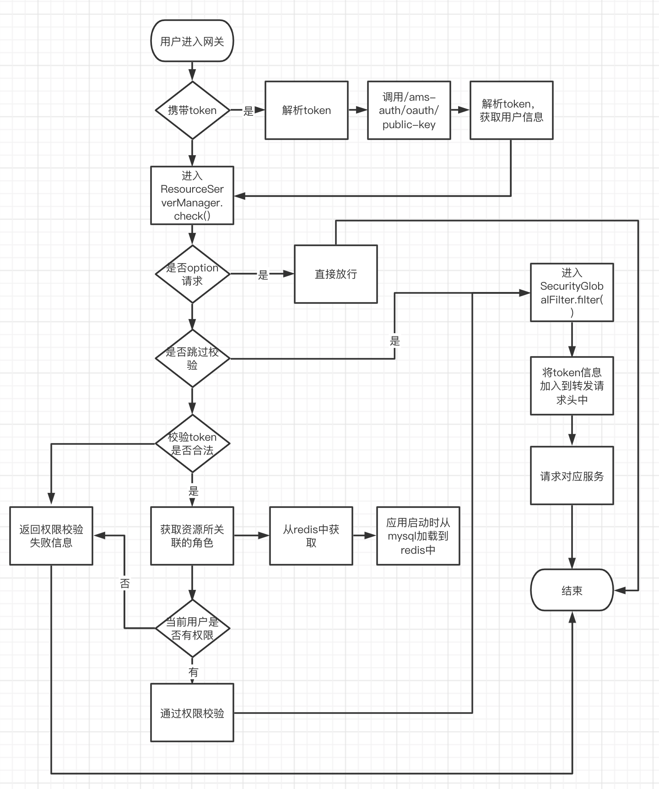

# 记录
## docker redis
```shell
        docker run \
        -p 6379:6379 --name mr \
        -v /usr/local/my-soft/redis/redis.conf:/etc/redis/redis.conf \
        -v /usr/local/my-soft/redis/data:/data:rw \
        -d redis redis-server /etc/redis/redis.conf \
        --appendonly yes \
        --requirepass "root"
```

## docker nacos
```shell
    docker  run \
    --name nacos -d \
    -p 8848:8848 \
    -p 9848:9848\
    --privileged=true \
    --restart=always \
    --link mysql:mysql \
    -e JVM_XMS=256m \
    -e JVM_XMX=256m \
    -e MODE=standalone \
    -e PREFER_HOST_MODE=hostname \
    -v /usr/local/my-soft/nacos/logs:/home/nacos/logs \
    -v /usr/local/my-soft/nacos/init.d/custom.properties:/home/nacos/init.d/custom.properties \
    nacos/nacos-server:v2.1.0-slim
```

## docker mysql
```shell
mkdir -p /usr/local/my-soft/mysql/conf
vim /usr/local/my-soft/mysql/conf/my.cnf
# 复制以下配置
[client]
default-character-set=utf8
[mysql]
default-character-set=utf8
[mysqld]
init_connect='SET collation_connection=utf8_unicode_ci'
init_connect='SET NAMES utf8'
character-set-server=utf8
collation-server=utf8_unicode_ci
skip-character-set-client-handshake
skip-name-resolve

# 运行脚本
docker run --name mysql -e MYSQL_ROOT_PASSWORD=123456 -p 3306:3306 -v /usr/local/my-soft/mysql/conf/hmy.cnf:/etc/mysql/conf.d/hmy.cnf -v /usr/local/my-soft/mysql/data:/var/lib/mysql -d arm64v8/mysql:oracle

```

## docker Sentinel
```shell
docker pull bladex/sentinel-dashboard
docker run --name sentinel -d -p 8858:8858 -d bladex/sentinel-dashboard:1.8.0 
docker run --name sentinel -p 8858:8858 -d bladex/sentinel-dashboard:1.8.0

# mac 可用
docker pull huoyingyang/sentinel-dashboard:1.8.3-arm64
docker run --name sentinel -p 8858:8858 -d huoyingyang/sentinel-dashboard:1.8.3-arm64
# 默认用户名密码
# sentinel

java -Dserver.port=8858 -Dcsp.sentinel.dashboard.server=localhost:8858 -Dproject.name=sentinel-dashboard -jar sentinel-dashboard-1.8.4.jar
```

## 遇到的问题
```shell
Server check fail, please check server 10.211.55.9 ,port 9848 is available , error ={}
```
docker 容器需要映射 9848 端口

## 网关权限流程

